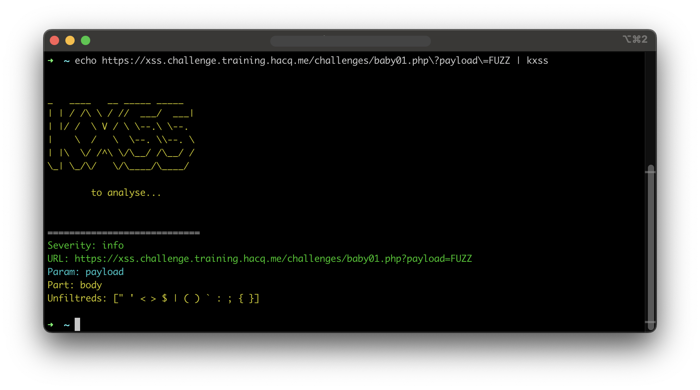

# <p align="center" width="100px" heigth="100px"></p>

## Changes to original kxss
I added a check to determine where the reflection occurs, either within a general body tag or within a script tag. This aims to facilitate explorations in script tags where some characters are not necessary.
I changed the output format of kxss to make it better grepable for my recon script. My new Output Looks like this:
```
============================
Severity: info
URL: http://testphp.vulnweb.com/listproducts.php?cat=FUZZ
Param: cat
Part: body
Unfiltreds: [" ' < >]
```

## Installation
To install this Tool please use the following Command:
```
go install github.com/phor3nsic/kxss@latest
```

## Usage
To run this script use the following command:
```
echo "http://testphp.vulnweb.com/hpp/params.php?p=xxxx" | kxss
```

## Question
If you have an question you can create an Issue or ping me on [![alt text][1.1]][1]
